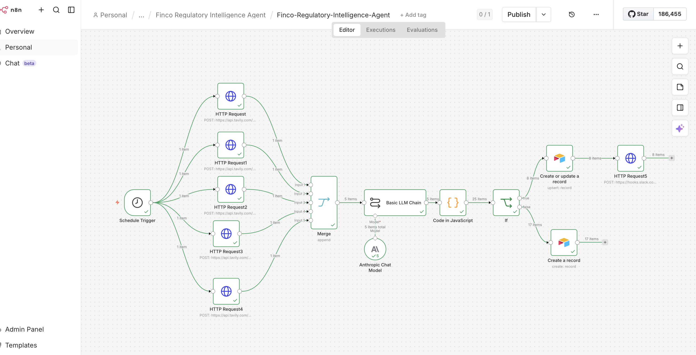
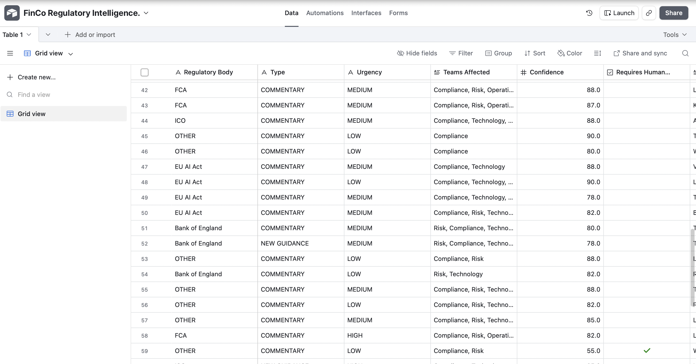
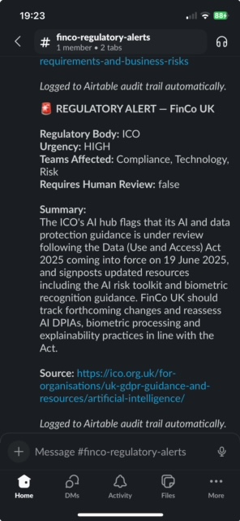

FinCo UK Regulatory Intelligence Agent

Overview

An autonomous AI agent that monitors five financial regulatory sources twice daily and delivers classified regulatory intelligence to the right teams through the right channels, without any human intervention required. Built for FinCo UK, a fictional 200 person fintech organisation, to demonstrate production grade agentic AI architecture with responsible AI principles embedded throughout.

The Business Problem

Compliance teams at regulated fintech organisations spend significant time manually monitoring regulatory updates across multiple bodies. Critical guidance gets missed or identified too late. No single source of truth exists for regulatory change. No audit trail documents what was reviewed and when. The cost of non-compliance in a regulated environment is potentially catastrophic.

The Solution

An autonomous agent that scans five regulatory sources every morning and evening, classifies each update using Claude, routes outputs to the right audiences through the right channels, and maintains a complete compliance audit trail, all without human triggering.

How It Works

A Schedule Trigger fires automatically at 6am and 6pm every day. Five HTTP Request nodes simultaneously fetch live regulatory updates from FCA, ICO, EU AI Act, Bank of England and HM Treasury using the Tavily Search API. A Merge node combines all results into one batch. Claude classifies each update, determining whether it is genuinely new guidance or commentary, which teams are affected, urgency level and confidence score. A Code node parses Claude's structured JSON output into individual items. An IF node routes items by urgency; HIGH and CRITICAL items trigger immediate Slack alerts to the relevant team channel, all items are logged to Airtable regardless of urgency.

Regulatory Sources Monitored

FCA — Financial Conduct Authority. Primary UK financial regulator covering consumer protection, market integrity and financial crime.

ICO — Information Commissioner's Office. Data protection and GDPR compliance covering all personal data handling.

EU AI Act — European Union Artificial Intelligence Act. Risk classification framework for AI systems with direct implications for FinCo's AI deployment strategy.

Bank of England — Monetary policy, financial stability and systemic risk guidance relevant to regulated financial institutions.

HM Treasury — Financial policy, fintech regulation and government AI strategy affecting the broader regulatory landscape.

Classification Framework

Claude classifies each regulatory update across seven dimensions. 

Type — whether the item is genuinely new primary guidance or third party commentary. 

Regulatory body — which of the five sources published it. 

Teams affected — which FinCo teams need to act, chosen from Compliance, Risk, Technology, HR and Operations. 

Urgency — rated Critical, High, Medium or Low based on implementation timeline and business impact. 

Confidence score — rated 0 to 100 reflecting how certain the classification is. 

Requires human review — automatically flagged true when confidence falls below 75. 

Summary — two sentence plain English explanation of what changed and why it matters to FinCo UK.

Enterprise Design Decisions

Confidence thresholds with mandatory human escalation. Any classification with confidence below 75 is automatically flagged for human review rather than distributed. In a compliance context a wrong classification is worse than no classification. The agent knows what it does not know.
Audience specific outputs. HIGH and CRITICAL urgency items trigger immediate Slack alerts. LOW and MEDIUM items are logged to Airtable only. This prevents alert fatigue while ensuring critical updates reach the right people immediately.
Source citation on every output. Every Slack alert includes the direct URL to the source document. Recipients can verify the original guidance themselves. No black box outputs.
Full compliance audit trail. Every regulatory update processed, regardless of urgency, is logged to Airtable with regulatory body, type, urgency, teams affected, confidence score, human review flag, summary, source URL and timestamp. This creates a regulatorily defensible record that could be produced in an enforcement scenario.
API credentials scoped to minimum permissions. Tavily scoped to search only. Airtable scoped to write to specific base only. Slack delivery via incoming webhook requiring no OAuth token storage. Least privilege applied throughout.
Scheduled autonomous operation. No human triggers required. The agent runs on schedule twice daily. Resilient by design.

Output Channels

Slack — immediate alert to finco-regulatory-alerts channel for HIGH and CRITICAL urgency items. Includes regulatory body, urgency level, teams affected, plain English summary and direct source URL.
Airtable — every processed item logged with full classification data and timestamp. Complete audit trail regardless of urgency level.

Tools Used

n8n — workflow automation and agent orchestration
Tavily Search API — live web search across regulatory sources
Claude API — regulatory update classification and summarisation
Airtable — compliance audit logging
Slack — real time alert delivery via incoming webhook

Skills Demonstrated

Agentic AI system design using ReAct pattern. Multi source data ingestion from live web sources. Structured JSON output prompting and parsing. Confidence threshold logic and human escalation design. Audience segmented multi channel output. Compliance audit trail architecture. Scheduled autonomous operation. Enterprise security controls including least privilege credentials and webhook based delivery. n8n workflow automation at intermediate to advanced level.

Known Issues and Design Decisions

The Basic LLM Chain processes each Tavily result individually returning a separate JSON response per item. A Code node handles both array and single object responses from Claude ensuring all items flow correctly through the pipeline regardless of response format.

Future Enhancements

Advanced Tavily search depth for production deployment to improve retrieval quality on regulatory sources. Explicit date parameter filtering to surface only content published within the last 24 hours. Separate Tavily API project IDs for development and production environments following standard enterprise credential management practice. Daily email digest to compliance team summarising all LOW and MEDIUM urgency items from the previous 24 hours. Pinecone duplicate detection fully implemented to prevent reprocessing of regulatory updates already seen. Python and LangChain rebuild demonstrating the same architecture in code. Azure AI Search replacing Pinecone in the enterprise Microsoft stack version. Pinecone duplicate detection — semantic similarity check before processing each regulatory update to prevent the same guidance being distributed multiple times from different sources. Index created and ready for implementation in v2.

## Screenshots

**Workflow Canvas**

**Airtable Regulatory Log**

**Slack Regulatory Alert**

